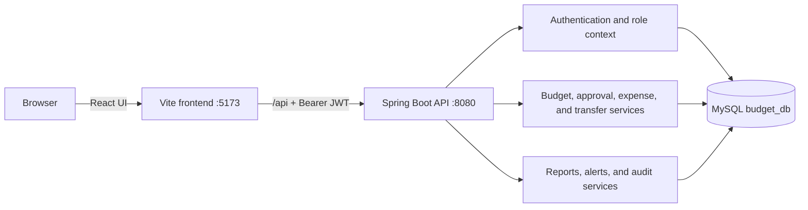
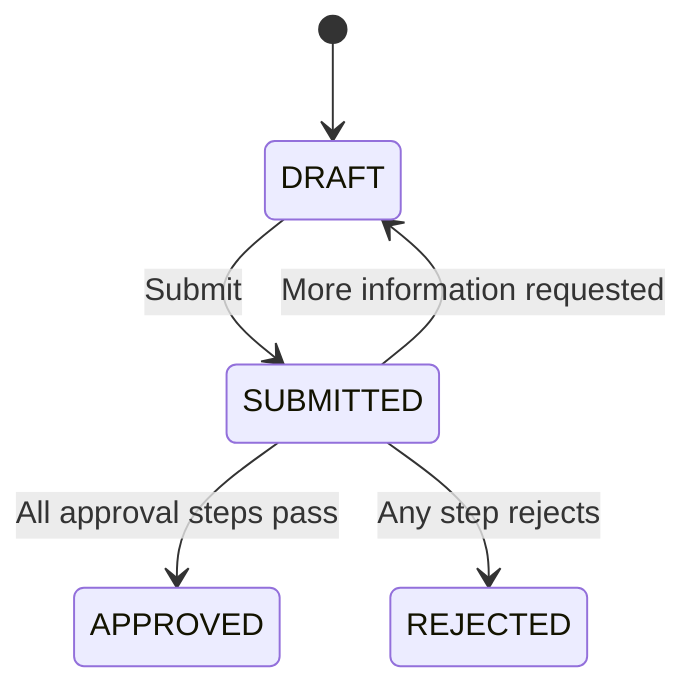

# Kapitofin

> A full-stack platform for planning, approving, tracking, and reporting organizational budgets across departments and regions.


Kapitofin brings the complete budget lifecycle into one application: allocation-aware budget creation, configurable approval tiers, expense tracking, fund transfers, utilization alerts, reporting, user administration, and audit history. It ships with realistic demo data and six role profiles, so the full workflow can be explored immediately.

## Highlights

- Budget drafts with categorized line items and allocation validation
- Amount-based, multi-level approval workflows
- Expense recording, review, and automatic spend updates
- Transfers between approved budgets with approval or rejection
- Department and regional reporting with utilization metrics
- Warning and critical alerts when spend crosses configured thresholds
- JWT authentication and a six-level role hierarchy
- Administrative management for users, regions, departments, categories, fiscal years, and allocations
- Audit logging for important budget actions
- Responsive React interface with dark mode, charts, filters, and quick demo login

## How it works



The Vite development server proxies `/api` requests to Spring Boot. The backend authenticates requests with a stateless JWT filter, applies workflow rules in the service layer, and persists data through Spring Data JPA.

## Technology stack

| Layer | Technologies |
| --- | --- |
| Frontend | React 18, React Router, TanStack Query, Zustand, Axios |
| UI | Tailwind CSS, Framer Motion, Lucide React, Recharts, React Hot Toast |
| Backend | Java 17, Spring Boot 3.2, Spring Web, Spring Security, Bean Validation |
| Data | Spring Data JPA, Hibernate, MySQL |
| Authentication | JWT with JJWT, BCrypt password hashing |
| Build | Maven, Vite, npm |
| Testing | JUnit 5, Mockito, Spring Boot Test |

## Quick start

### Prerequisites

- Java 17 or newer
- Maven 3.9 or newer
- Node.js 18 or newer and npm
- MySQL 8 or newer

### 1. Start MySQL

Make sure MySQL is running and that the configured user can create databases. The default JDBC URL includes `createDatabaseIfNotExist=true`, so Hibernate can create and initialize `budget_db` automatically.

### 2. Start the backend

From the project root, set local credentials as environment variables and run Spring Boot.

**PowerShell**

```powershell
cd backend
$env:SPRING_DATASOURCE_USERNAME = "root"
$env:SPRING_DATASOURCE_PASSWORD = "your-mysql-password"
$env:APP_JWT_SECRET = "replace-with-a-random-secret-at-least-32-characters-long"
mvn spring-boot:run
```

**macOS or Linux**

```bash
cd backend
export SPRING_DATASOURCE_USERNAME=root
export SPRING_DATASOURCE_PASSWORD='your-mysql-password'
export APP_JWT_SECRET='replace-with-a-random-secret-at-least-32-characters-long'
mvn spring-boot:run
```

The API starts at `http://localhost:8080`. On the first run, Hibernate creates the schema and the application loads demo records when `APP_SEED_DATA` is enabled.

### 3. Start the frontend

Open a second terminal:

```bash
cd frontend
npm ci
npm run dev
```

Open **http://localhost:5173**. If PowerShell blocks `npm.ps1`, use `npm.cmd ci` and `npm.cmd run dev` instead.

## Demo accounts

Demo seeding is enabled by default. Every account below uses the password `password`.

| Role | Email | Typical access |
| --- | --- | --- |
| Employee | `jane.employee@budget.com` | View budgets, record expenses, view alerts |
| Budget Analyst | `john.analyst@budget.com` | Create and submit budgets, view reports |
| Department Head | `mike.head@budget.com` | Department approvals, expenses, and transfers |
| Regional Finance Manager | `sarah.regional@budget.com` | Regional approvals, reports, and transfers |
| Finance Director | `cathy.director@budget.com` | Organization administration and audit history |
| Super Admin | `admin@budget.com` | Full access, including user management |

> Demo credentials are for local development only. Disable seeding and replace all default secrets before deploying the application.

## Budget lifecycle



New submissions generate approval steps according to the budget total:

| Condition | Required approval |
| --- | --- |
| Every submitted budget | Department Head |
| Total above `$25,000` | Regional Finance Manager |
| Total above `$100,000` | Finance Director |

The thresholds are configuration values and can be changed without recompiling the application.

## Configuration

Spring Boot's relaxed binding allows the properties in `backend/src/main/resources/application.properties` to be overridden with environment variables.

| Environment variable | Default | Purpose |
| --- | --- | --- |
| `SERVER_PORT` | `8080` | Backend HTTP port |
| `SPRING_DATASOURCE_URL` | `jdbc:mysql://localhost:3306/budget_db?...` | MySQL connection URL |
| `SPRING_DATASOURCE_USERNAME` | `root` | Database user |
| `SPRING_DATASOURCE_PASSWORD` | Development value in properties | Database password |
| `APP_JWT_SECRET` | Development value in properties | JWT signing key; use at least 32 random characters |
| `APP_JWT_EXPIRATION_MS` | `86400000` | Token lifetime in milliseconds |
| `APP_APPROVAL_L2_THRESHOLD` | `25000` | Regional approval threshold |
| `APP_APPROVAL_L3_THRESHOLD` | `100000` | Finance Director approval threshold |
| `APP_APPROVAL_ALERT_THRESHOLD` | `0.9` | Utilization ratio that triggers an alert |
| `APP_SEED_DATA` | `true` | Load the local demo dataset on startup |

## API overview

The login endpoint is public. Send an `Authorization: Bearer <token>` header with requests to protected routes.

| Area | Base route | Main operations |
| --- | --- | --- |
| Authentication | `/api/auth` | Login and current user |
| Budgets | `/api/budgets` | Search, create, edit, delete, submit |
| Approvals | `/api/approvals` | Pending work and decisions |
| Expenses | `/api/expenses` | Record, list, approve, reject |
| Transfers | `/api/transfers` | Request, approve, reject |
| Reports | `/api/reports` | Dashboard and department summaries |
| Alerts | `/api/alerts` | Global and per-budget alerts |
| Reference data | `/api/reference` | Regions, departments, categories, fiscal years |
| Administration | `/api/admin` | Organization, users, allocations, alerts, audit logs |
| Audit history | `/api/audit-logs` | Paged and entity-specific audit events |

Example login request:

```bash
curl -X POST http://localhost:8080/api/auth/login \
  -H "Content-Type: application/json" \
  -d '{"email":"john.analyst@budget.com","password":"password"}'
```

Use the returned token on protected endpoints:

```bash
curl http://localhost:8080/api/budgets \
  -H "Authorization: Bearer YOUR_TOKEN"
```

## Project structure

```text
BudgetManagementSystem/
├── backend/
│   ├── pom.xml
│   └── src/
│       ├── main/java/com/budget/app/
│       │   ├── bootstrap/      # Demo data loader
│       │   ├── config/         # Security and JPA configuration
│       │   ├── controller/     # REST endpoints
│       │   ├── dto/            # API request and response models
│       │   ├── entity/         # JPA entities and enums
│       │   ├── exception/      # API error handling
│       │   ├── repository/     # Spring Data repositories
│       │   ├── security/       # JWT authentication
│       │   └── service/        # Business workflows
│       └── resources/application.properties
└── frontend/
    ├── package.json
    ├── vite.config.js
    └── src/
        ├── api/                # Axios client and endpoint modules
        ├── components/         # Shared UI and layouts
        ├── features/           # Domain pages
        ├── lib/                # Permissions and utilities
        └── store/              # Zustand state stores
```

## Verification

Run the backend tests:

```bash
cd backend
mvn test
```

Build the frontend:

```bash
cd frontend
npm ci
npm run build
```

The frontend build output is written to `frontend/dist`.

## Production checklist

Before exposing the application outside a trusted development environment:

- Set `APP_SEED_DATA=false` and remove any demo users already created.
- Supply the database password and a strong JWT key through a secret manager or environment variables.
- Restrict the wildcard CORS policy in `SecurityConfig` to known frontend origins.
- Put the API behind HTTPS and a reverse proxy.
- Route same-origin `/api` traffic to the Spring Boot service; Vite's proxy only applies during development.
- Replace `spring.jpa.hibernate.ddl-auto=update` with reviewed database migrations.
- Review and enforce authorization on backend operations for your organization's policy; UI visibility is not a security boundary.
- Add broader service, controller, and end-to-end coverage before production use.

## Contributing

Keep changes focused, add tests for backend workflow rules, and make sure both verification commands above pass before opening a pull request. For UI work, verify the relevant pages with more than one demo role—the application intentionally exposes different actions at different privilege levels.
